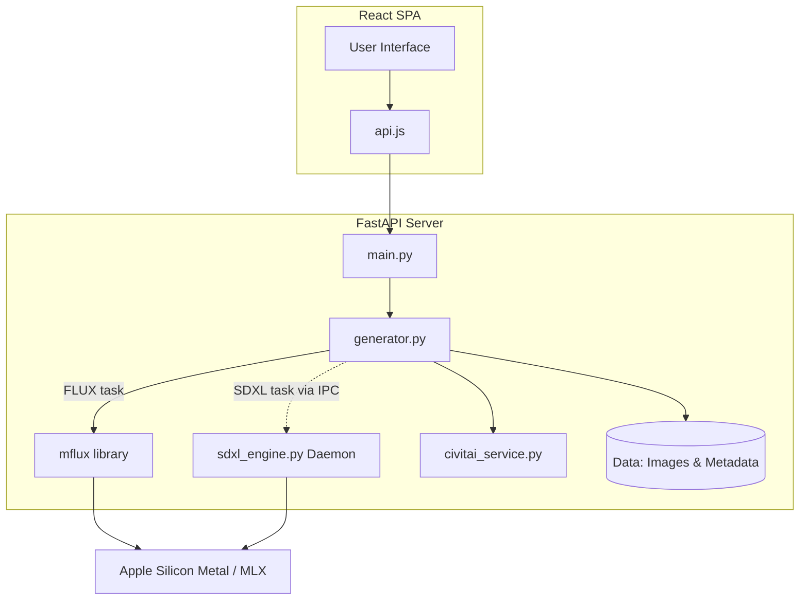

# MLX-Diffusion - System Architecture & Global README

## High-Level System Overview

MLX-Diffusion is a local, highly-optimized image-generation playground designed specifically for Apple Silicon via the MLX framework. The application allows users to generate images utilizing state-of-the-art diffusion models, notably **FLUX.2-klein 4B** and **Juggernaut XL Lightning (SDXL)**. By leveraging Apple's unified memory architecture, it provides rapid inference without relying on cloud services.

The system is structured as a decoupled architecture: a FastAPI backend manages generation queues, metadata injection, and model inference, while a React 19/Vite Single Page Application (SPA) provides a responsive, real-time user interface. A unique dual-engine pattern is employed on the backend to safely separate the execution contexts and dependencies of the FLUX and SDXL models.

## Component Architecture

The codebase is split into two primary domains: `backend/` and `frontend/`.

### Frontend (`/frontend`)
A Single Page Application built with React 19 and bundled using Vite. It handles user interactions, prompt configuration, and result visualization.

* **Application Core (`src/App.jsx`):** Orchestrates the overall layout, application state, and child components.
* **API Client (`src/api.js`):** Encapsulates HTTP requests to the FastAPI backend, utilizing environment variables (`VITE_API_BASE`) or defaulting to `http://localhost:8001`.
* **UI Components (`src/components/`):**
  * `GenerateForm.jsx`: The primary interface for user inputs, including prompting, model selection, parameter tuning, and LoRA inclusion.
  * `ResultCanvas.jsx`: A real-time display area for the currently generating or most recently completed image.
  * `GenerationStack.jsx`: Manages the queue and visual history of active or pending generation requests.
  * `Gallery.jsx`: Renders a grid of previously generated images fetched from the backend's persistent storage.

### Backend (`/backend`)
A RESTful FastAPI server providing task queuing, metadata management, and hardware-accelerated model inference.

* **Routing & Entry (`main.py`):** Defines the FastAPI application, mounts static/media files, and exposes API routes (generation, gallery, metadata extraction, and model management).
* **Generation Orchestration (`generator.py`):** The core engine manager. It handles concurrent job queuing (ensuring single-threaded GPU access), processes generation tasks for FLUX directly via the `mflux` library, and delegates SDXL tasks. It is also responsible for embedding EXIF and A1111/Civitai-compatible metadata into output PNGs.
* **SDXL Subprocess Engine (`sdxl_engine.py`):** An isolated Python daemon running within a dedicated virtual environment (`venv-sdxl`). It communicates with `generator.py` via JSON-RPC over `stdin`/`stdout`. This isolation prevents dependency conflicts between FLUX's `mflux` and SDXL's `mlx-diffuser`/`torch` requirements.
* **Civitai Service (`civitai_service.py`):** Interfaces with the Civitai API to resolve, download, and construct metadata for LoRAs and checkpoints.
* **Auxiliary Modules:**
  * `prompt_enhancer.py`: Utilities for prompt modification and automated augmentation.
  * `taesd_mlx.py`: A Tiny AutoEncoder for Stable Diffusion implemented in MLX for rapid latent decoding and image previews.
* **Data Persistence (`data/`):**
  * `generated/`: Stores generated `.png` images alongside their `.json` metadata sidecars.
  * `loras.json`: A JSON registry mapping local LoRAs to their base models and activation triggers.
  * `lora_files/`, `models/`, `SDXL/`: Caches for downloaded weights, LoRA tensors, and converted checkpoints.

### Architecture Diagram



## Data Flow

1. **User Request:** The user submits a generation request via `GenerateForm.jsx` in the frontend UI.
2. **API Submission:** The frontend API client (`api.js`) sends a POST request to `/api/generate` on the backend.
3. **Queueing:** `main.py` receives the request and enqueues a background task in `generator.py`, utilizing a threading lock to ensure sequential GPU access and prevent out-of-memory errors.
4. **Engine Routing & Inference:**
   * **FLUX Model:** `generator.py` directly executes inference within the main backend process using the `mflux` library.
   * **SDXL Model:** `generator.py` routes the payload via standard input to the persistent `sdxl_engine.py` subprocess daemon. The daemon executes generation, periodically yielding status and progress back to `generator.py` over standard output.
5. **Post-Processing & Metadata:** Once latents are decoded into a final image array, `generator.py` builds comprehensive metadata (including prompt, seed, sampler configuration, and Civitai ecosystem IDs) and injects it into the PNG's EXIF data.
6. **Storage & Delivery:** The image and its JSON sidecar are saved to `backend/data/generated/`. The frontend is notified and updates the `ResultCanvas` and `Gallery` components via HTTP polling to `/api/images/{id}`.

## Technical Stack & Dependencies

* **Hardware Target:** Apple Silicon (M1/M2/M3/M4 series processors) leveraging unified memory.
* **Operating System:** macOS.
* **Frontend:** React 19, Vite, HTML/CSS/JS.
* **Backend:** Python 3.10+ (Primary) / Python 3.14 (SDXL Engine).
* **Web Framework:** FastAPI, Uvicorn.
* **Image Processing:** Pillow (PIL).
* **Machine Learning Frameworks:** MLX (Apple), `mflux` (for FLUX), `mlx-diffuser` (for SDXL), PyTorch/Diffusers (for SDXL checkpoint conversion only).

## Setup and Initialization

To bootstrap a development environment for the first time, you will need to start both the backend server and the frontend development server.

### 1. Backend Setup

The backend utilizes two separate Python environments to prevent dependency collisions.

```bash
cd /Volumes/Externe/IA/MLX-DIFFUSION/backend

# Create and activate the primary virtual environment
python -m venv ../venv
source ../venv/bin/activate

# Install primary backend dependencies
pip install fastapi uvicorn pillow mflux

# Ensure the SDXL virtual environment is also prepared
# (Requires mlx-diffuser and torch installed in venv-sdxl)
python -m venv ../venv-sdxl

# Start the FastAPI server (Hardcoded to port 8001 to avoid conflicts)
./../venv/bin/uvicorn main:app --reload --port 8001
```

### 2. Frontend Setup

In a new terminal window:

```bash
cd /Volumes/Externe/IA/MLX-DIFFUSION/frontend

# Install Node.js dependencies
npm install

# Start the Vite development server
npm run dev
```

* **Access the UI:** The frontend will start at `http://localhost:5173` (or similar) and will proxy API requests to the backend at `http://localhost:8001`.
* **First Run:** The initial generation request for a new model will trigger an automatic download of the model weights from HuggingFace to the local cache. This process may take several minutes depending on network speed (e.g., ~2–3 GB for FLUX.2-klein).
