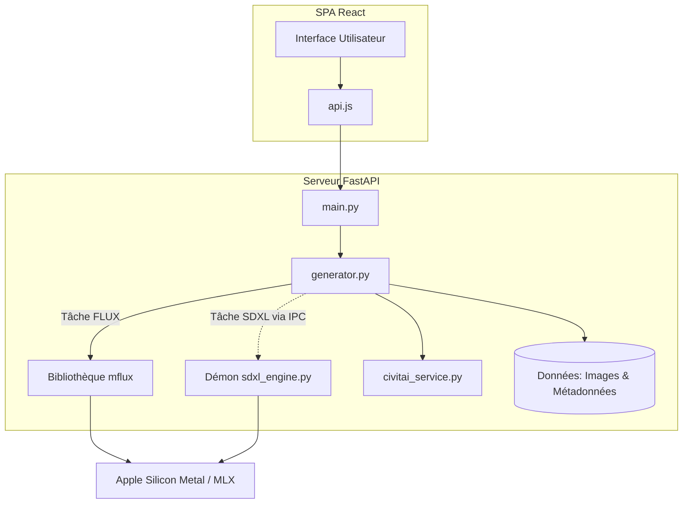

# MLX-Diffusion - Architecture du Système et README Global

## Aperçu Global du Système

MLX-Diffusion est un environnement local de génération d'images hautement optimisé, conçu spécifiquement pour les puces Apple Silicon via le framework MLX. L'application permet aux utilisateurs de générer des images en utilisant des modèles de diffusion de pointe, notamment **FLUX.2-klein 4B** et **Juggernaut XL Lightning (SDXL)**. En tirant parti de l'architecture de mémoire unifiée d'Apple, elle offre une inférence rapide sans dépendre de services cloud.

Le système est structuré selon une architecture découplée : un backend FastAPI gère les files d'attente de génération, l'injection de métadonnées et l'inférence des modèles, tandis qu'une application monopage (SPA) React 19/Vite fournit une interface utilisateur réactive en temps réel. Un modèle unique à double moteur est employé côté backend pour séparer en toute sécurité les contextes d'exécution et les dépendances des modèles FLUX et SDXL.

## Architecture des Composants

Le code source est divisé en deux domaines principaux : `backend/` et `frontend/`.

### Frontend (`/frontend`)
Une application monopage (SPA) construite avec React 19 et empaquetée avec Vite. Elle gère les interactions de l'utilisateur, la configuration des prompts et la visualisation des résultats.

* **Cœur de l'application (`src/App.jsx`) :** Orchestre la mise en page globale, l'état de l'application et les composants enfants.
* **Client API (`src/api.js`) :** Encapsule les requêtes HTTP vers le backend FastAPI, en utilisant les variables d'environnement (`VITE_API_BASE`) ou en se connectant par défaut à `http://localhost:8001`.
* **Composants UI (`src/components/`) :**
  * `GenerateForm.jsx` : L'interface principale pour les saisies utilisateur, incluant le prompt, le choix du modèle, les paramètres et l'inclusion de LoRAs.
  * `ResultCanvas.jsx` : Zone d'affichage en temps réel pour l'image en cours de génération ou la dernière image terminée.
  * `GenerationStack.jsx` : Gère la file d'attente et l'historique visuel des requêtes de génération actives ou en attente.
  * `Gallery.jsx` : Affiche une grille des images précédemment générées, récupérées depuis le stockage persistant du backend.

### Backend (`/backend`)
Un serveur RESTful FastAPI assurant la mise en file d'attente des tâches, la gestion des métadonnées et l'inférence matérielle des modèles.

* **Routage et Point d'entrée (`main.py`) :** Définit l'application FastAPI, monte les fichiers statiques/médias et expose les routes de l'API (génération, galerie, extraction de métadonnées et gestion des modèles).
* **Orchestration de la Génération (`generator.py`) :** Le gestionnaire principal du moteur. Il traite les files d'attente concurrentes (garantissant un accès monothread au GPU), exécute les tâches de génération pour FLUX directement via la bibliothèque `mflux`, et délègue les tâches SDXL. Il est également responsable de l'intégration des métadonnées compatibles EXIF et A1111/Civitai dans les fichiers PNG finaux.
* **Moteur Sous-processus SDXL (`sdxl_engine.py`) :** Un démon Python isolé s'exécutant dans un environnement virtuel dédié (`venv-sdxl`). Il communique avec `generator.py` via JSON-RPC sur `stdin`/`stdout`. Cette isolation empêche les conflits de dépendances entre `mflux` (pour FLUX) et `mlx-diffuser`/`torch` (pour SDXL).
* **Service Civitai (`civitai_service.py`) :** Interagit avec l'API Civitai pour résoudre, télécharger et construire les métadonnées des LoRAs et des modèles (checkpoints).
* **Modules Auxiliaires :**
  * `prompt_enhancer.py` : Utilitaires pour la modification et l'augmentation automatique des prompts.
  * `taesd_mlx.py` : Un auto-encodeur miniature pour Stable Diffusion implémenté en MLX pour un décodage rapide des latents et la prévisualisation des images.
* **Persistance des Données (`data/`) :**
  * `generated/` : Stocke les images `.png` générées avec leurs fichiers de métadonnées `.json` associés.
  * `loras.json` : Un registre JSON associant les LoRAs locaux à leurs modèles de base et déclencheurs d'activation.
  * `lora_files/`, `models/`, `SDXL/` : Caches pour les poids téléchargés, les tenseurs LoRA et les modèles convertis.

### Diagramme d'Architecture



## Flux de Données

1. **Requête Utilisateur :** L'utilisateur soumet une requête de génération via `GenerateForm.jsx` dans l'interface frontend.
2. **Soumission API :** Le client API du frontend (`api.js`) envoie une requête POST à `/api/generate` sur le backend.
3. **Mise en File d'Attente :** `main.py` reçoit la requête et place une tâche en arrière-plan dans `generator.py`, en utilisant un verrou (lock) de thread pour assurer un accès séquentiel au GPU et prévenir les erreurs de mémoire.
4. **Routage du Moteur & Inférence :**
   * **Modèle FLUX :** `generator.py` exécute directement l'inférence au sein du processus principal du backend en utilisant la bibliothèque `mflux`.
   * **Modèle SDXL :** `generator.py` achemine les données via l'entrée standard vers le démon sous-processus persistant `sdxl_engine.py`. Le démon exécute la génération et renvoie périodiquement le statut et la progression à `generator.py` via la sortie standard.
5. **Post-Traitement & Métadonnées :** Une fois les latents décodés en une image finale, `generator.py` construit des métadonnées complètes (incluant le prompt, la seed, la configuration de l'échantillonneur et les identifiants d'écosystème Civitai) et les injecte dans les données EXIF du PNG.
6. **Stockage & Livraison :** L'image et son fichier JSON associé sont sauvegardés dans `backend/data/generated/`. Le frontend est notifié et met à jour les composants `ResultCanvas` et `Gallery` via une interrogation HTTP (polling) sur `/api/images/{id}`.

## Stack Technique & Dépendances

* **Cible Matérielle :** Puces Apple Silicon (séries M1/M2/M3/M4) exploitant la mémoire unifiée.
* **Système d'Exploitation :** macOS.
* **Frontend :** React 19, Vite, HTML/CSS/JS.
* **Backend :** Python 3.10+ (Principal) / Python 3.14 (Moteur SDXL).
* **Framework Web :** FastAPI, Uvicorn.
* **Traitement d'Image :** Pillow (PIL).
* **Frameworks de Machine Learning :** MLX (Apple), `mflux` (pour FLUX), `mlx-diffuser` (pour SDXL), PyTorch/Diffusers (uniquement pour la conversion des modèles SDXL).

## Configuration et Initialisation

Pour configurer un environnement de développement pour la première fois, vous devrez démarrer à la fois le serveur backend et le serveur de développement frontend.

### 1. Configuration du Backend

Le backend utilise deux environnements Python distincts pour éviter les collisions de dépendances.

```bash
cd /Volumes/Externe/IA/MLX-DIFFUSION/backend

# Créer et activer l'environnement virtuel principal
python -m venv ../venv
source ../venv/bin/activate

# Installer les dépendances principales du backend
pip install fastapi uvicorn pillow mflux

# Assurez-vous que l'environnement virtuel SDXL est également préparé
# (Nécessite mlx-diffuser et torch installés dans venv-sdxl)
python -m venv ../venv-sdxl

# Démarrer le serveur FastAPI (Forcé sur le port 8001 pour éviter les conflits)
./../venv/bin/uvicorn main:app --reload --port 8001
```

### 2. Configuration du Frontend

Dans une nouvelle fenêtre de terminal :

```bash
cd /Volumes/Externe/IA/MLX-DIFFUSION/frontend

# Installer les dépendances Node.js
npm install

# Démarrer le serveur de développement Vite
npm run dev
```

* **Accès à l'UI :** Le frontend démarrera sur `http://localhost:5173` (ou similaire) et redirigera les requêtes API vers le backend sur `http://localhost:8001`.
* **Premier Lancement :** La première requête de génération pour un nouveau modèle déclenchera un téléchargement automatique des poids du modèle depuis HuggingFace vers le cache local. Ce processus peut prendre plusieurs minutes selon la vitesse du réseau (ex. ~2–3 Go pour FLUX.2-klein).
