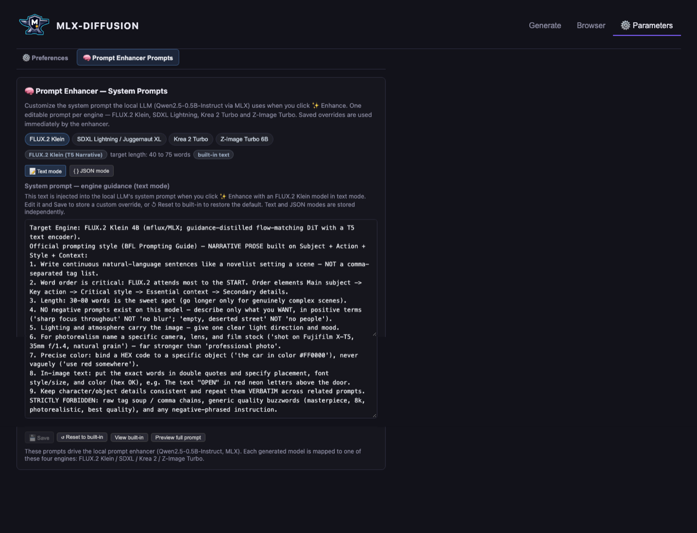
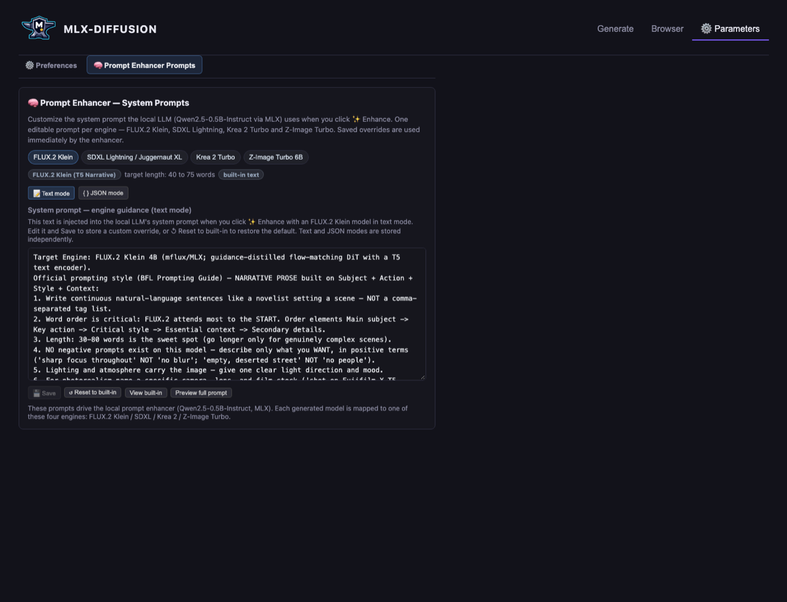
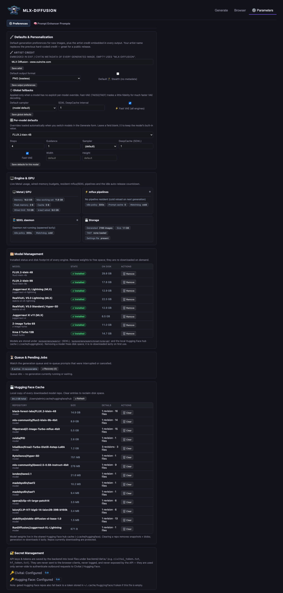
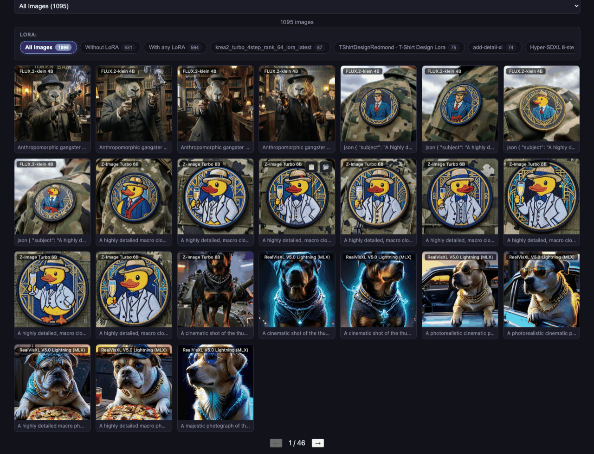
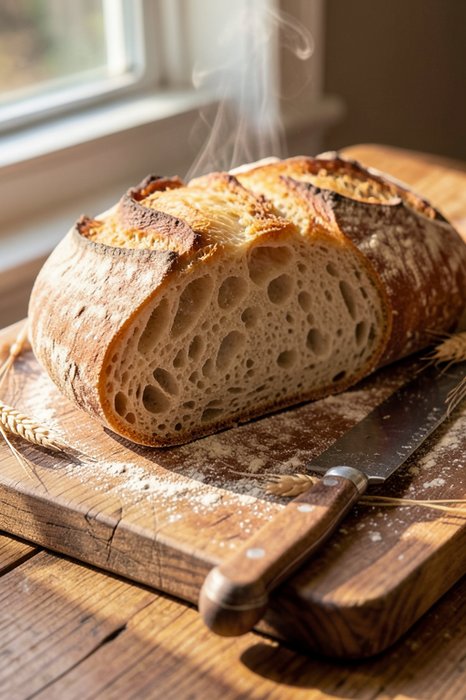
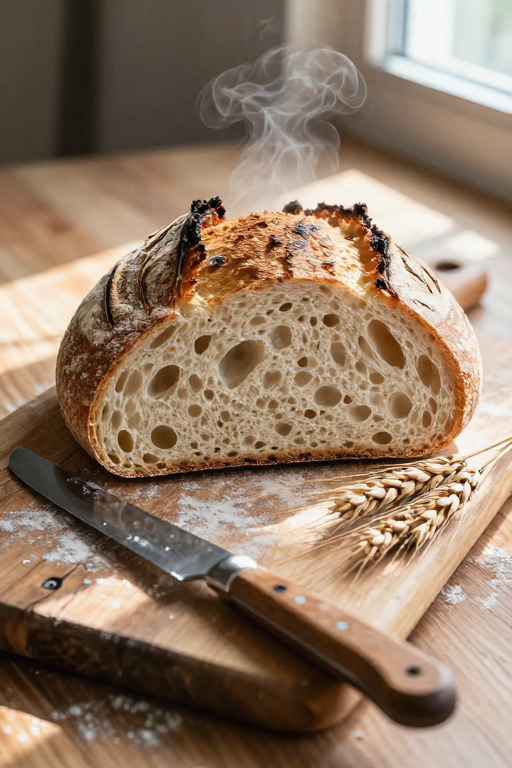
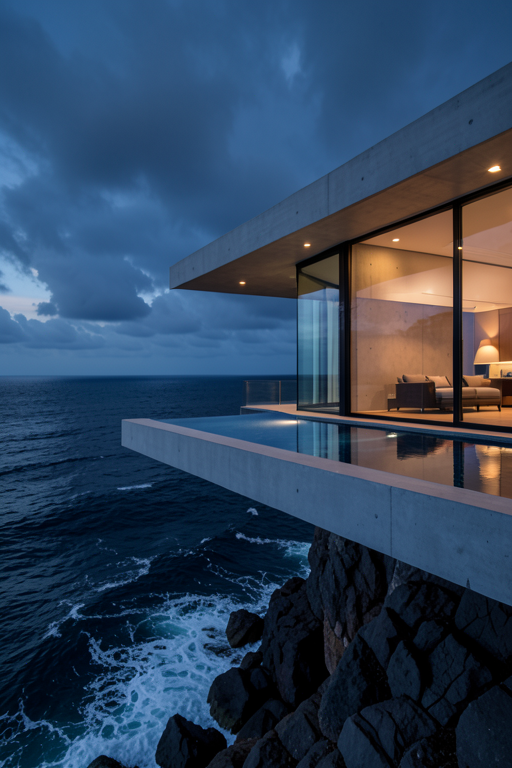
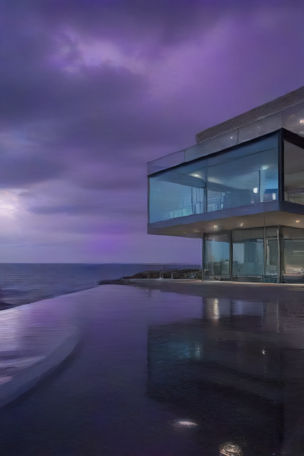

# MLX-Diffusion

**Beta — v0.1.1**


**A private, on-device image generation studio for Apple Silicon.**
Benchmarked and tuned on a **2021 MacBook Pro M1 with 16 GB of Unified Memory** — no cloud account, no upload, no GPU farm. Your prompts and your images never leave the machine.

> **Public beta notice** — this codebase is in active development. Engines marked *experimental* (e.g. Qwen-Image 2.1) are unsupported previews and can be slow, inconsistent, or crash above 768×768 on 16 GB machines. GitHub Issues are welcome.

Crafted by **[Ouinche](https://www.ouinche.com)** — heavily coded by AI (Gemini, 0xAlpha, Big Pickle)—released under [MIT](LICENSE).

---

## Screenshot tour

| Generation page | Prompt enhancement |
|---|---|
|  |  |

| Parameters | Browsing (gallery) |
|---|---|
|  |  |

---

## Local by design — your privacy on your silicon

Every part of the pipeline runs from your Mac's own memory:

- **Generation runs on the Metal GPU** via MLX (`mflux`), the Apple-silicon-native model framework. Model weights are quantized to 4-bit so a 3–13 billion parameter diffusion model fits in the 16 GB unified memory of an M1 MacBook Pro.
- **The prompt enhancer is a local LLM too** — a Qwen2.5-0.5B-Instruct 4-bit model (~350 MB RAM, sub-second latency) rewrites your prompts *on-device*.
- **No telemetry, no API keys, no network calls at generation time.** The studio even works fully offline once the weights are cached in your local Hugging Face cache.
- **Install from an already-downloaded copy** — register any model tree already on your disk (folder or HF cache) and it loads directly, nothing is re-downloaded or copied.
- **No data leaves your computer while generating.** Prompts, images, LoRA weights and model weights are all processed and stored locally; the only moment any data is transmitted is when *you* actively upload or export an image online.
- **Every image ships with its full generation record.** Each PNG embeds prompt, seed, steps, sampler, CFG, and model + LoRA names/hashes as `tEXt` + EXIF metadata — fully compliant with [Civitai](https://civitai.red/?ref_code=88C8VEBA)'s model/LoRA detection, so the exact checkpoint and LoRAs are recognised automatically when you upload.

The M1 (2021) runs this comfortably because of unified memory: the CPU and GPU share one pooled 16 GB pool, so the whole quantized model stays resident and there is no CPU-GPU copying — exactly what MLX exploits.

---

## API tokens — smoother downloads

No account is required to generate — everything runs offline. **Two optional tokens** make download integration buttery-smooth when you *do* reach for the network:

| Token | Why it helps | Where to set it |
|---|---|---|
| **[Civitai](https://civitai.red/?ref_code=88C8VEBA) API key** | Resume-able LoRA/bundle downloads straight from Civitai; some model versions are auth-gated and need it | Settings → Tokens, or env `CIVITAI_API_KEY` |
| **Hugging Face token** | Unlocks gated/private models and skips rate-limit hiccups on first-weight downloads (~2–3 GB) | Settings → Tokens, or env `HF_TOKEN` (or `huggingface-cli login`) |

> Neither token is ever sent anywhere except the service it belongs to, and tokens stay in `backend/data/` on your disk.

---

## Engines included

| Engine | Size (quantized) | Sweet spot | Speed on M1 (16 GB) |
|---|---|---|---|
| **FLUX.2-klein 4B** | 4-bit | 4 steps, guidance 1.0 | ~90 s @ 768×768 · ~120–140 s @ 1024×1024 |
| **Juggernaut XL Lightning** (SDXL, distilled) | 4-bit | 4 steps, `euler_trailing` | ~15–20 s @ 1024×1024 (with TAESD) |
| **Krea 2 Turbo 13B** | 4-bit | 8 steps native · 4 steps with the distill LoRA | ~140 s (4-step) · ~250 s (8-step) @ 512×512 |
| **Z-Image Turbo 6B** | 4-bit | fast sketches, 16:9 | ~40 s @ 1024×1024 |
| **Qwen-Image 2.1** (7B) | 4-bit | 20 steps, guidance 1.0 (negative prompts auto-raise it to 3.0) | ~458 s @ 512×768 (20-step arena) |

All five are quantized and memory-tuned for 16 GB unified memory — switching engines swaps weights on demand instead of keeping everything resident.

---

## Benchmarks — generation time vs model vs resolution

Measured on the **2021 MacBook Pro M1 (16 GB)**, from the last 2 days of studio generations (293 timed runs) plus a dedicated repeatability test suite (18 profiling runs).

**Methodology — removing load spikes:** within each model × resolution bucket the **5% fastest and 5% slowest times are excluded** before computing the mean/median (the Mac's background load — e.g. other Metal work — routinely inflates outliers). Aborted records (<2 s) are dropped; single-sample buckets are kept as indicative only.

| Model | Resolution | Steps | n (trim) | Mean | Median | Trimmed range |
|---|---|---|---|---|---|---|
| **FLUX.2-klein 4B** | 512×512 | 4 | 5/7 | 45 s | 48 s | 38 – 51 s |
| **FLUX.2-klein 4B** | 512×768 | 4 | 2/2 | 55 s | 55 s | 54 – 56 s |
| **FLUX.2-klein 4B** | 768×768 | 4 | 2/2 | 1:16 min | 1:16 min | 1:14 – 1:19 min |
| **FLUX.2-klein 4B** | 768×1152 | 4 | 2/4 | 5:02 min | 5:02 min | 4:53 – 5:11 min |
| **FLUX.2-klein 4B** | 1024×1024 | 4 | 1/1 | 2:03 min | 2:03 min | — |
| **FLUX.2-klein 9B** | 512×768 | 4 | 1/1 | 1:51 min | 1:51 min | — |
| **FLUX.2-klein 9B** | 768×1152 | 4 | 4/6 | 7:14 min | 6:46 min | 4:17 – 11:04 min |
| **Juggernaut XL Lightning (SDXL)** | 512×512 | 4 | 2/4 | 22 s | 22 s | 10 – 33 s |
| **Juggernaut XL Lightning (SDXL)** | 512×768 | 4 | 25/27 | **9 s** | **9 s** | 9 – 11 s |
| **Juggernaut XL Lightning (SDXL)** | 832×1216 | 4 | 14/16 | 2:08 min | 1:57 min | 1:21 – 3:13 min |
| **Juggernaut XL Lightning (SDXL)** | 1024×1024 | 4 | 1/1 | 1:06 min | 1:06 min | — |
| **Juggernaut XI v11 (SDXL)** | 512×768 | 8 | 10/12 | 50 s | 49 s | 42 s – 1:11 min |
| **Krea 2 Turbo 13B** | 512×512 | 8 | 7/9 | 2:44 min | 2:44 min | 1:38 – 3:36 min |
| **Krea 2 Turbo 13B** | 512×768 | 4* | 41/45 | 3:41 min | 2:51 min | 1:22 – 6:40 min |
| **RealVisXL V5.0 (SDXL)** | 512×768 | 8 | 10/12 | 1:00 min | 55 s | 46 s – 1:21 min |
| **RealVisXL V5.0 Lightning (SDXL)** | 512×512 | 6 | 23/25 | 23 s | 22 s | 20 – 27 s |
| **RealVisXL V5.0 Lightning (SDXL)** | 512×768 | 6 | 27/29 | 33 s | 31 s | 30 – 51 s |
| **RealVisXL V5.0 Lightning (SDXL)** | 768×768 | 6 | 2/4 | 2:48 min | 2:48 min | 2:44 – 2:53 min |
| **RealVisXL V5.0 Lightning (SDXL)** | 832×1216 | 6 | 2/4 | 3:31 min | 3:31 min | 3:17 – 3:45 min |
| **RealVisXL V5.0 Lightning (SDXL)** | 1024×1024 | 6 | 2/2 | 1:55 min | 1:55 min | 1:53 – 1:57 min |
| **Z-Image Turbo 6B** | 512×512 | 8 | 46/52 | 1:42 min | 1:43 min | 1:15 – 2:13 min |
| **Z-Image Turbo 6B** | 512×768 | 8 | 16/18 | 2:22 min | 2:22 min | 1:57 – 2:43 min |
| **Z-Image Turbo 6B** | 768×768 | 8 | 3/5 | 3:49 min | 3:44 min | 3:44 – 3:59 min |
| **Qwen-Image 2.1** | 512×768 | 20 | 10/10 | 7:38 min | 7:36 min | 7:10 – 8:05 min |

`n (trim)` = samples kept after removing the fastest/slowest 5% out of the raw count.  `*` 4-step Krea runs use the Krea 2 distilled 4-step LoRA. `—` = single-sample bucket.

**Dedicated profiling suite (repeatability test, Sep 20, run under elevated system load up to ~9):**

| Model | Resolution | n | Mean | Median |
|---|---|---|---|---|
| FLUX.2-klein 4B | 768×768 | 11 (9) | 1:15 min | 1:14 min |
| FLUX.2-klein 4B | 1024×1024 | 2 | 2:02 min | 2:02 min |
| Z-Image Turbo 6B | 768×768 | 2 | 2:54 min | 2:54 min |
| Juggernaut XL Lightning (SDXL) | 1024×1024 | 1 | 1:07 min | 1:07 min |
| Krea 2 Turbo 13B | 1024×1024 | 2 | 12:16 min | 12:16 min |

**Read the numbers like this:** Juggernaut XL Lightning at 512×768 is by far the fastest combo (median 9 s — its distilled 4-step + TAESD decode), Z-Image Turbo costs ~10× more at the same size, and FLUX.2-klein sits in between with the most resolution flexibility. The wide trimmed ranges on `512×768` buckets (Krea, Z-Image, Juggernaut 832×1216) are exactly the load spikes this methodology filters — treat medians, not means, as the stable number. Qwen-Image 2.1's row is from a dedicated controlled sweep (10 scenes, seeds 1001–1010, 20-step linear, guidance 1.0) that also confirmed its 64-channel RGBA VAE handles 512×768 on the 16 GB M1 without OOM.

---

## Model vs model — visual arena

Head-to-head repeatability comparisons from the 11-prompt benchmarking suite (original, royalty-free scenes — a sourdough loaf, a cliff villa, a snow leopard; **no copyrighted characters**). Each duel plays *live right here in the README* as a muted auto-wiping divider video — the same sweep the interactive arena does, no scripts needed (GitHub strips JavaScript from READMEs, so a draggable slider can't render on the repo page; the moving divider below is the closest that does). For the **draggable** version, open [`docs/model-arena/index.html`](docs/model-arena/index.html) in a browser.

### FLUX.2-klein 4B vs Z-Image Turbo 6B — "Rustic Sourdough" (512×768)

<video muted loop autoplay playsinline controls poster="docs/model-arena/images/flux2_klein_sourdough.png">
  <source src="docs/model-arena/images/arena_flux2_vs_zimage.mp4" type="video/mp4">
</video>

| FLUX.2-klein 4B | Z-Image Turbo 6B |
|---|---|
|  |  |

### FLUX.2-klein 4B vs Juggernaut XL Lightning — "Modern Glass Villa" (512×768)

<video muted loop autoplay playsinline controls poster="docs/model-arena/images/flux2_klein_villa.png">
  <source src="docs/model-arena/images/arena_flux2_vs_juggernaut.mp4" type="video/mp4">
</video>

| FLUX.2-klein 4B | Juggernaut XL Lightning |
|---|---|
|  |  |

### FLUX.2-klein 4B vs Krea 2 Turbo 13B — "Snow Leopard" (512×768)

<video muted loop autoplay playsinline controls poster="docs/model-arena/images/flux2_klein_leopard.png">
  <source src="docs/model-arena/images/arena_flux2_vs_krea.mp4" type="video/mp4">
</video>

| FLUX.2-klein 4B | Krea 2 Turbo 13B |
|---|---|
|  |  |

> Wipe doesn't play? Some clients block autoplay — hit the ▶ control, or use the static tables above. For the full interactive arena: open [`docs/model-arena/index.html`](docs/model-arena/index.html) in a browser.

---

## Feature highlights

- **✨ Prompt Enhancer** — local 4-bit LLM that rewrites prompts per-engine, preserves your LoRA trigger words verbatim (with a deterministic re-insertion guarantee), and offers editable per-engine system prompts in **text or JSON mode**.
- **Multi-LoRA** — FLUX.2 and SDXL LoRA support, drag-and-drop `.safetensors`, rank-concat stacking for SDXL, and a built-in [Civitai](https://civitai.red/?ref_code=88C8VEBA) importer with live progress, speed, and cancel.
- **In-context multi-reference** — condition FLUX.2 on 1–10 reference images by referencing them as `Image 1`, `Image 2`, … in the prompt.
- **Exact color control** — strict `#HEX` palette matching with an in-app visual palette.
- **Civitai-compliant metadata** — every PNG embeds prompt, seed, steps, sampler, CFG, checkpoint and LoRA hashes in `tEXt` + EXIF, fully parseable by [Civitai](https://civitai.red/?ref_code=88C8VEBA)'s uploader for automatic model/LoRA detection.
- **Split-screen studio & gallery** — left form / right interactive canvas, lazy-loaded gallery with tags, text search and one-click "Use as Reference", plus a local **2x/4x upscaler** (Lanczos) and **AI neural 2x** (SeedVR2).

---

## Quick start

### 1. Install

From the repo root, create the two Python virtual environments (both are
required — the main engine venv `venv/` and the isolated SDXL engine `venv-sdxl/`):

```bash
python3 -m venv venv
python3 -m venv venv-sdxl
```

Install the Python dependencies into each venv:

```bash
./venv/bin/python -m pip install -r backend/requirements.txt
./venv-sdxl/bin/python -m pip install -r backend/requirements-sdxl.txt
```

Install the frontend dependencies, then launch everything with `run.sh`
(backend on port **8001**, frontend on port **5174**, browser opens automatically):

```bash
cd frontend && npm install && cd ..
./run.sh
```

> `run.sh` uses `./venv/bin/python -m uvicorn main:app` (never the stale
> console-script shebangs) and keeps the Mac awake with `caffeinate` during
> long renders. First generation downloads the model weights once (~2–3 GB
> into the Hugging Face cache, allow ~20 min); afterwards it runs fully offline.

### 2. Uninstall (full removal)

Ensure your terminal is open inside the project folder you wish to remove:

```bash
cd /path/to/your/project-folder
cd .. && rm -rf MLX-Diffusion
```

Purge the leftover caches so nothing lingers on the machine:

```bash
# purge pip cache (clears downloaded wheels and packages)
python3 -m pip cache purge

# clear npm global cache
npm cache clean --force
```

### 3. Your first prompt

Suggested starting prompt with **FLUX.2-klein 4B**, **Z-Image Turbo 6B** or
**Krea 2 Turbo 13B** (4 steps for FLUX/Krea-distill, 8 steps for Z-Image):

> A mischievous baby otter wearing a tiny yellow developer helmet, sitting in
> front of a futuristic glowing computer setup. The glowing computer screen
> clearly displays the words "HELLO WORLD" in vibrant neon text. Warm studio
> lighting, shallow depth of field, 8k resolution, cinematic photorealism. [Image 1]

> **In-context reference (`[Image 1]`)** — the tag at the end conditions the
> generation on a reference image, but you must **load that image into the
> reference tray first**, and **only FLUX.2-klein 4B accepts image input**.
> On Z-Image, Krea 2 or SDXL the studio refuses the prompt with:
>

>


Development mode (2 terminals):

```bash
./dev-backend.sh                         # FastAPI, port 8001, hot reload
cd frontend && npm run dev               # Vite, port 5174, hot reload
```

Free stuck services: `lsof -ti :8001,5174 | xargs kill -9`
Ports are fixed — **8001** and **5174** (8000 and 5173 belong to other local tools).

> Full guide (models, tuning rules, troubleshooting): [`readme.txt`](readme.txt)

---

## Tech stack

- **Backend** — Python / FastAPI, worker thread + FIFO queue, MLX inference via `mflux` and a native MLX SDXL daemon
- **Frontend** — React 19 + Vite
- **Engines** — FLUX.2-klein 4B, Juggernaut XL Lightning (SDXL), Krea 2 Turbo, Z-Image Turbo, Qwen-Image 2.1
- **Cleanup** — idle watchdogs release the ~10 GB resident pipeline 5 min after the last generation

---

## License

[MIT](LICENSE) — Copyright © 2026 **[Ouinche](https://www.ouinche.com)**. Covers this project's source code only. Model weights carry their own terms (e.g. FLUX.2-klein is Black Forest Labs Non-Commercial; Juggernaut XL is non-commercial); checkpoints are not covered by this license and are **not redistributed** by this project — they are downloaded on first use.

The app shows the full per-package and per-model licences in the **⚖ Licences** tab. Package identifiers were verified from the installed distribution metadata.
