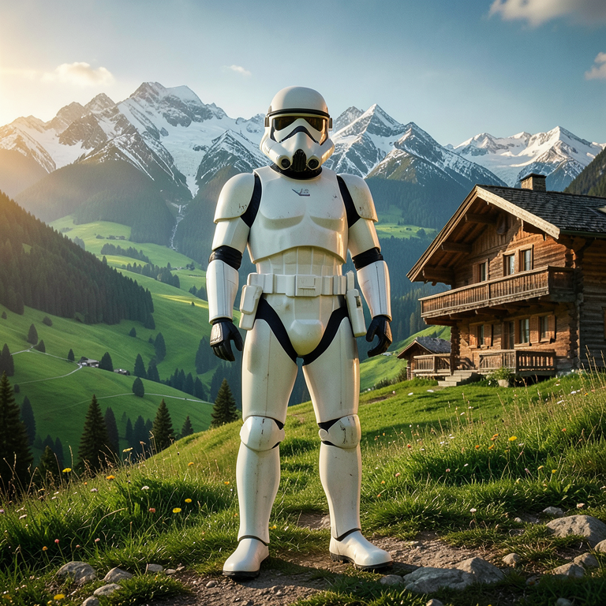
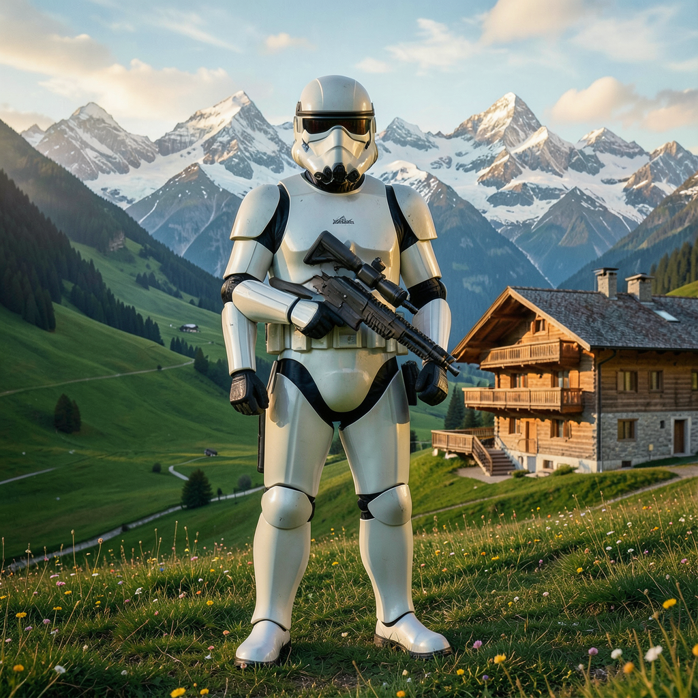
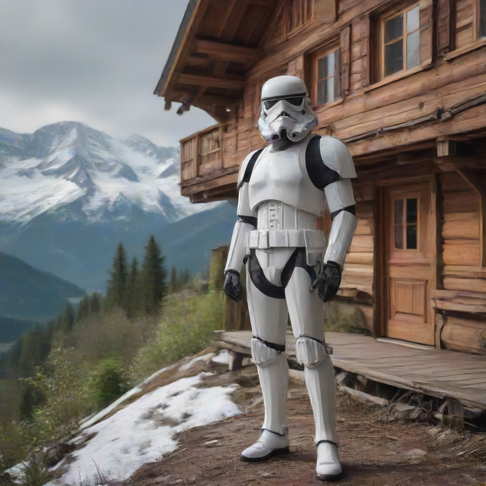

# MLX-DIFFUSION


**A private, on-device image generation studio for Apple Silicon.**
Benchmarked and tuned on a **2021 MacBook Pro M1 with 16 GB of Unified Memory** — no cloud account, no upload, no GPU farm. Your prompts and your images never leave the machine.

---

## Local by design — your privacy on your silicon

Every part of the pipeline runs from your Mac's own memory:

- **Generation runs on the Metal GPU** via MLX (`mflux`), the Apple-silicon-native model framework. Model weights are quantized to 4-bit so a 3–13 billion parameter diffusion model fits in the 16 GB unified memory of an M1 MacBook Pro.
- **The prompt enhancer is a local LLM too** — a Qwen2.5-0.5B-Instruct 4-bit model (~350 MB RAM, sub-second latency) rewrites your prompts *on-device*.
- **No telemetry, no API keys, no network calls at generation time.** The studio even works fully offline once the weights are cached in your local Hugging Face cache.
- **Install from an already-downloaded copy** — register any model tree already on your disk (folder or HF cache) and it loads directly, nothing is re-downloaded or copied.

The M1 (2021) runs this comfortably because of unified memory: the CPU and GPU share one pooled 16 GB pool, so the whole quantized model stays resident and there is no CPU-GPU copying — exactly what MLX exploits.

---

## Engines included

| Engine | Size (quantized) | Sweet spot | Speed on M1 (16 GB) |
|---|---|---|---|
| **FLUX.2-klein 4B** | 4-bit | 4 steps, guidance 1.0 | ~90 s @ 768×768 · ~120–140 s @ 1024×1024 |
| **Juggernaut XL Lightning** (SDXL, distilled) | 4-bit | 4 steps, `euler_trailing` | ~15–20 s @ 1024×1024 (with TAESD) |
| **Krea 2 Turbo 13B** | 4-bit | 8 steps native · 4 steps with the distill LoRA | ~140 s (4-step) · ~250 s (8-step) @ 512×512 |
| **Z-Image Turbo 6B** | 4-bit | fast sketches, 16:9 | ~40 s @ 1024×1024 |

All four are quantized and memory-tuned for 16 GB unified memory — switching engines swaps weights on demand instead of keeping everything resident.

---

## Benchmarks — generation time vs model vs resolution

Measured on the **2021 MacBook Pro M1 (16 GB)**, from the last 2 days of studio generations (293 timed runs) plus a dedicated repeatability test suite (18 profiling runs).

**Methodology — removing load spikes:** within each model × resolution bucket the **5% fastest and 5% slowest times are excluded** before computing the mean/median (the Mac's background load — e.g. other Metal work — routinely inflates outliers). Aborted records (<2 s) are dropped; single-sample buckets are kept as indicative only.

| Model | Resolution | Steps | n (trim) | Mean | Median | Trimmed range |
|---|---|---|---|---|---|---|
| **FLUX.2-klein 4B** | 512×512 | 4 | 5/7 | 45 s | 48 s | 38 – 51 s |
| **FLUX.2-klein 4B** | 512×768 | 4 | 2/2 | 55 s | 55 s | 54 – 56 s |
| **FLUX.2-klein 4B** | 768×768 | 4 | 2/2 | 1:16 min | 1:16 min | 1:14 – 1:19 min |
| **FLUX.2-klein 4B** | 768×1152 | 4 | 2/4 | 5:02 min | 5:02 min | 4:53 – 5:11 min |
| **FLUX.2-klein 4B** | 1024×1024 | 4 | 1/1 | 2:03 min | 2:03 min | — |
| **FLUX.2-klein 9B** | 512×768 | 4 | 1/1 | 1:51 min | 1:51 min | — |
| **FLUX.2-klein 9B** | 768×1152 | 4 | 4/6 | 7:14 min | 6:46 min | 4:17 – 11:04 min |
| **Juggernaut XL Lightning (SDXL)** | 512×512 | 4 | 2/4 | 22 s | 22 s | 10 – 33 s |
| **Juggernaut XL Lightning (SDXL)** | 512×768 | 4 | 25/27 | **9 s** | **9 s** | 9 – 11 s |
| **Juggernaut XL Lightning (SDXL)** | 832×1216 | 4 | 14/16 | 2:08 min | 1:57 min | 1:21 – 3:13 min |
| **Juggernaut XL Lightning (SDXL)** | 1024×1024 | 4 | 1/1 | 1:06 min | 1:06 min | — |
| **Juggernaut XI v11 (SDXL)** | 512×768 | 8 | 10/12 | 50 s | 49 s | 42 s – 1:11 min |
| **Krea 2 Turbo 13B** | 512×512 | 8 | 7/9 | 2:44 min | 2:44 min | 1:38 – 3:36 min |
| **Krea 2 Turbo 13B** | 512×768 | 4* | 41/45 | 3:41 min | 2:51 min | 1:22 – 6:40 min |
| **RealVisXL V5.0 (SDXL)** | 512×768 | 8 | 10/12 | 1:00 min | 55 s | 46 s – 1:21 min |
| **RealVisXL V5.0 Lightning (SDXL)** | 512×512 | 6 | 23/25 | 23 s | 22 s | 20 – 27 s |
| **RealVisXL V5.0 Lightning (SDXL)** | 512×768 | 6 | 27/29 | 33 s | 31 s | 30 – 51 s |
| **RealVisXL V5.0 Lightning (SDXL)** | 768×768 | 6 | 2/4 | 2:48 min | 2:48 min | 2:44 – 2:53 min |
| **RealVisXL V5.0 Lightning (SDXL)** | 832×1216 | 6 | 2/4 | 3:31 min | 3:31 min | 3:17 – 3:45 min |
| **RealVisXL V5.0 Lightning (SDXL)** | 1024×1024 | 6 | 2/2 | 1:55 min | 1:55 min | 1:53 – 1:57 min |
| **Z-Image Turbo 6B** | 512×512 | 8 | 46/52 | 1:42 min | 1:43 min | 1:15 – 2:13 min |
| **Z-Image Turbo 6B** | 512×768 | 8 | 16/18 | 2:22 min | 2:22 min | 1:57 – 2:43 min |
| **Z-Image Turbo 6B** | 768×768 | 8 | 3/5 | 3:49 min | 3:44 min | 3:44 – 3:59 min |

`n (trim)` = samples kept after removing the fastest/slowest 5% out of the raw count.  `*` 4-step Krea runs use the Krea 2 distilled 4-step LoRA. `—` = single-sample bucket.

**Dedicated profiling suite (repeatability test, Sep 20, run under elevated system load up to ~9):**

| Model | Resolution | n | Mean | Median |
|---|---|---|---|---|
| FLUX.2-klein 4B | 768×768 | 11 (9) | 1:15 min | 1:14 min |
| FLUX.2-klein 4B | 1024×1024 | 2 | 2:02 min | 2:02 min |
| Z-Image Turbo 6B | 768×768 | 2 | 2:54 min | 2:54 min |
| Juggernaut XL Lightning (SDXL) | 1024×1024 | 1 | 1:07 min | 1:07 min |
| Krea 2 Turbo 13B | 1024×1024 | 2 | 12:16 min | 12:16 min |

**Read the numbers like this:** Juggernaut XL Lightning at 512×768 is by far the fastest combo (median 9 s — its distilled 4-step + TAESD decode), Z-Image Turbo costs ~10× more at the same size, and FLUX.2-klein sits in between with the most resolution flexibility. The wide trimmed ranges on `512×768` buckets (Krea, Z-Image, Juggernaut 832×1216) are exactly the load spikes this methodology filters — treat medians, not means, as the stable number.

---

## Model vs model — visual arena

Head-to-head repeatability images (prompt: stormtrooper in a swiss alpine valley · seed **1337** · same prompt per pair). Each duel plays *live right here in the README* as a muted auto-wiping divider video — the same sweep the interactive arena does, no scripts needed (GitHub strips JavaScript from READMEs, so a draggable slider can't render on the repo page; the moving divider below is the closest that does). For the **draggable** version, open [`docs/model-arena/index.html`](docs/model-arena/index.html) in a browser.

### 768 × 768 — FLUX.2-klein 4B vs Z-Image Turbo 6B (4 vs 8 steps)

<video muted loop autoplay playsinline controls poster="docs/model-arena/images/flux2_klein_768.png">
  <source src="docs/model-arena/images/arena_flux2_vs_zimage.mp4" type="video/mp4">
</video>

| FLUX.2-klein 4B (median 1:16) | Z-Image Turbo 6B (median 2:54) |
|---|---|
|  |  |

### 1024 × 1024 — FLUX.2-klein 4B vs Juggernaut XL Lightning

<video muted loop autoplay playsinline controls poster="docs/model-arena/images/flux2_klein_1024.png">
  <source src="docs/model-arena/images/arena_flux2_vs_juggernaut.mp4" type="video/mp4">
</video>

| FLUX.2-klein 4B (median 2:03) | Juggernaut XL Lightning (median 1:07) |
|---|---|
|  |  |

### 1024 × 1024 — FLUX.2-klein 4B vs Krea 2 Turbo 13B

<video muted loop autoplay playsinline controls poster="docs/model-arena/images/flux2_klein_1024.png">
  <source src="docs/model-arena/images/arena_flux2_vs_krea.mp4" type="video/mp4">
</video>

| FLUX.2-klein 4B (median 2:03) | Krea 2 Turbo 13B (median 12:16*) |
|---|---|
|  |  |

\* Krea 2 Turbo at 1024×1024 ran under elevated system load; its realistic sweet spot is 512×768 (2:51 median) or 512×512 (2:44).

> Wipe doesn't play? Some mail/clients block autoplay — hit the ▶ control, or use the static tables above. For the full interactive arena: open [`docs/model-arena/index.html`](docs/model-arena/index.html) in a browser.

---

## Feature highlights

- **✨ Prompt Enhancer** — local 4-bit LLM that rewrites prompts per-engine, preserves your LoRA trigger words verbatim (with a deterministic re-insertion guarantee), and offers editable per-engine system prompts in **text or JSON mode**.
- **Multi-LoRA** — FLUX.2 and SDXL LoRA support, drag-and-drop `.safetensors`, rank-concat stacking for SDXL, and a built-in **Civitai importer** with live progress, speed, and cancel.
- **In-context multi-reference** — condition FLUX.2 on 1–10 reference images by referencing them as `Image 1`, `Image 2`, … in the prompt.
- **Exact color control** — strict `#HEX` palette matching with an in-app visual palette.
- **Civitai-compliant metadata** — every PNG embeds prompt, seed, steps, sampler, CFG, checkpoint and LoRA hashes in `tEXt` + EXIF, fully parseable by Civitai's uploader.
- **Split-screen studio & gallery** — left form / right interactive canvas, lazy-loaded gallery with tags, text search and one-click "Use as Reference", plus a local **2x/4x upscaler** (Lanczos) and **AI neural 2x** (SeedVR2).

---

## Quick start

From the repo root:

```bash
./run.sh        # one command: backend (8001) + frontend (5174), opens the browser
```

Development mode (2 terminals):

```bash
./dev-backend.sh                         # FastAPI, port 8001, hot reload
cd frontend && npm run dev               # Vite, port 5174, hot reload
```

Free stuck services: `lsof -ti :8001,5174 | xargs kill -9`
Ports are fixed — **8001** and **5174** (8000 and 5173 belong to other local tools).

> Full guide (models, tuning rules, troubleshooting): [`readme.txt`](readme.txt)

---

## Tech stack

- **Backend** — Python / FastAPI, worker thread + FIFO queue, MLX inference via `mflux` and a native MLX SDXL daemon
- **Frontend** — React 19 + Vite
- **Engines** — FLUX.2-klein 4B, Juggernaut XL Lightning (SDXL), Krea 2 Turbo, Z-Image Turbo
- **Cleanup** — idle watchdogs release the ~10 GB resident pipeline 5 min after the last generation

---

## License

[MIT](LICENSE) — covers this project's source code only. Model weights carry their own terms (e.g. FLUX.2-klein is Black Forest Labs Non-Commercial); checkpoints are not covered by this license.